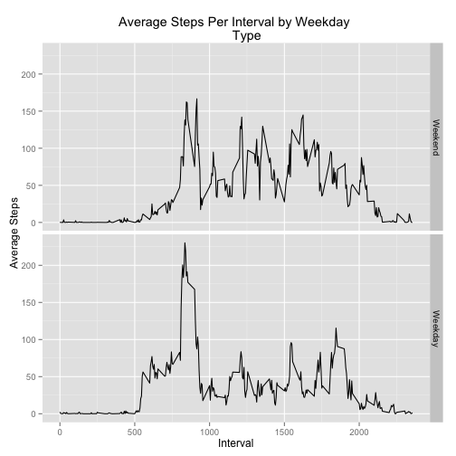

Reproducible Research Assignment One
===================================

The analysis begins by setting the working directory and adding the necessary packages to
my library.

```r
##Set the working directory
setwd("/Users/danliebermann/Documents/Coursera/Reproducible Research")


##Add ggplot2 and plyr packages to library
library(ggplot2)
library(plyr)
```

This assignment uses data from a personal activity monitoring device.  The data measures steps taken while wearing the device in five miute intervals.  We load the data and prep it for analysis by converting the date column into a date.

```r
##Read in activity monitoring data
activityRaw<-read.csv("activity.csv")
##Covert a date column formatted as a date and add to dataframe
activityRaw[,2]<-as.character(activityRaw[,2])
date<-strptime(activityRaw[,2], "%Y-%m-%d")
activityRaw<-cbind(activityRaw[,c(1,3)], date)
```

The following code answers two questions regarding the total steps taken per day.

1. Make a histogram of the total number of steps taken each day
2. Calculate and report the mean and median total number of steps taken per day


```r
##Create a dataframe summarizing steps per day and name columns
dailySteps<-ddply(activityRaw, .(date), summarize, sum(steps))
names(dailySteps)<-c("date", "steps")
##Plot a histogram
with(dailySteps, plot(date, steps, type = "h", main = "Total Steps Per Day", xlab = "Date", ylab = "Total Steps"))
```

 

```r
##Calculate the mean and median total steps taken per day
median(na.omit(dailySteps$steps))
```

```
## [1] 10765
```

```r
mean(na.omit(dailySteps$steps))
```

```
## [1] 10766
```

The next section of code answers the below questions to explore daily activity patterns.

1.Make a time series plot (i.e. type = "l") of the 5-minute interval (x-axis) and the average number of steps taken, averaged across all days (y-axis)
2.Which 5-minute interval, on average across all the days in the dataset, contains the maximum number of steps?


```r
##Calculate the average steps taken per five minute interal
averageSteps<-mean(activityRaw$steps)
##Add a column indicating sequence of intervals
activityRaw[,4]<-rownames(activityRaw)
names(activityRaw)<-c("steps", "interval", "date", "row.number")
#Plot the number of steps taken per interval
with(activityRaw, plot(row.number, steps, type = "l", main = "Steps Per Interval", xlab = "Interval", ylab = "Steps"))
abline(h=averageSteps, col = "red")
```

 

```r
##Determine which interval in the data set has the most steps
averageInterval<-ddply(na.omit(activityRaw), .(interval), summarize, mean(steps))
names(averageInterval)<-c("interval","steps")
##Return the five minute interval with most average steps across days
subset(averageInterval, steps==max(averageInterval$steps))
```

```
##     interval steps
## 104      835 206.2
```

The next section of code imputes missing values by taking the average number of steps for a given interval and using it to replace an NA value.  It answer the following questions.

1.Calculate and report the total number of missing values in the dataset (i.e. the total number of rows with NAs)
2. Devise a strategy for filling in all of the missing values in the dataset. The strategy does not need to be sophisticated. For example, you could use the mean/median for that day, or the mean for that 5-minute interval, etc.
3. Create a new dataset that is equal to the original dataset but with the missing data filled in.
4. Make a histogram of the total number of steps taken each day and Calculate and report the mean and median total number of steps taken per day. Do these values differ from the estimates from the first part of the assignment? What is the impact of imputing missing data on the estimates of the total daily number of steps?


```r
##Determine how many rows have NAs by subtracting dataframe length from complete cases count
length(activityRaw[,1]) - sum(complete.cases(activityRaw))
```

```
## [1] 2304
```

```r
##Replace NA step values with the average number of steps for that interval
##Create a dataframe for the average steps per interval
imputeTable<-ddply(na.omit(activityRaw), .(interval), summarize, mean(steps))
names(imputeTable)<-c("interval","average.steps")
activitywAverage<-merge(activityRaw, imputeTable, by = "interval", all.x = TRUE)
##A loop to run through the steps column and replace each NA with the average steps for that interval
i<-1
  while(i <= length(activitywAverage[,1])){
    if(is.na(activitywAverage[i,2])==TRUE){
      activitywAverage[i,2]<-activitywAverage[i,5]
    }
    i<-i+1  
  }
##Create a second dataframe summarizing steps per day and name columns
dailySteps2<-ddply(activitywAverage, .(date), summarize, sum(steps))
names(dailySteps2)<-c("date", "steps")
##Plot a histogram
with(dailySteps2, plot(date, steps, type = "h", main = "Total Steps Per Day (w/ Imputed Dat", xlab = "Date", ylab = "Total Steps"))
```

 

```r
##Calculate the mean and median total steps taken per day
median(dailySteps2$steps)
```

```
## [1] 10766
```

```r
mean(dailySteps2$steps)
```

```
## [1] 10766
```

```r
##Determine the difference between the non-imputed and imputed data by median and mean
median(dailySteps2$steps)-median(na.omit(dailySteps$steps))
```

```
## [1] 1.189
```

```r
mean(dailySteps2$steps)-mean(na.omit(dailySteps$steps))
```

```
## [1] 0
```

The final piece of analysis generates two graphs to explore how activity differs on weekends compared to weekdays.  As the graphs show, there is more actvity in the afternoon on weekends compared to weekdays.


```r
##Determine if there are differences between weekends and weekdays
##Add a new column to the matrix with the weekday
activitywAverage[,6]<-weekdays(activitywAverage$date)
##Assign weekday and weekend values to the data set using the factor funtion
##First weekday and weekend values are assigned to a vector based on the day of the week
activitywAverage[,7]<-factor(activitywAverage[,6], levels = c("Sunday", "Monday",
  "Tuesday", "Wednesday", "Thursday", "Friday", "Saturday"), labels = c("Weekend"
  , "Weekday", "Weekday", "Weekday", "Weekday", "Weekday", "Weekend"))
```

```
## Warning: duplicated levels in factors are deprecated
```

```r
##Next the new vector is converted to characters and re-converted to a vector of just two factors
activitywAverage[,7]<-as.character(activitywAverage[,7])
activitywAverage[,7]<-factor(activitywAverage[,7], levels = c("Weekend", "Weekday"),
    labels = c("Weekend", "Weekday"))
names(activitywAverage)<-c(names(activitywAverage[1:5]),"weekday","weekdayorweekend")
##Name columns
names(activitywAverage)<-c(names(activitywAverage[1:5]),"weekday","weekdayorweekend")
##Create a dataframe to plot
plotWeekdays<-ddply(activitywAverage, .(interval, weekdayorweekend), summarize, mean(steps))
names(plotWeekdays)<-c("interval","weekdayorweekend", "averagesteps")
##Plot line graphs
qplot(interval, averagesteps, data = plotWeekdays, geom = "line", 
      facets = weekdayorweekend~., main = "Average Steps Per Interval by Weekday 
      Type", ylab = "Average Steps", xlab = "Interval")
```

 
